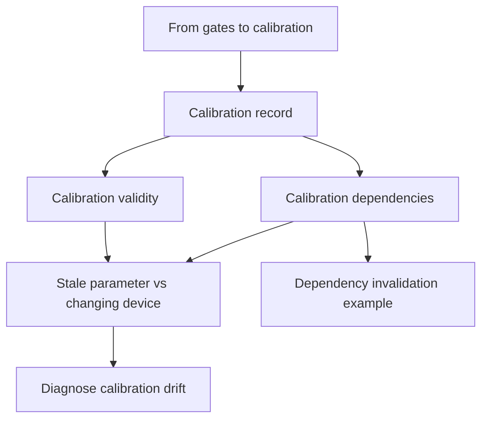
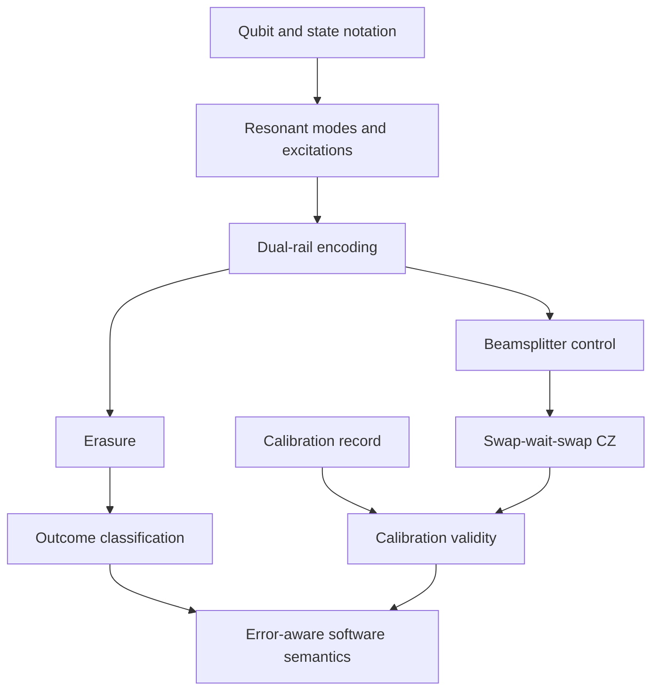

# Initial concept map

## Initial taxonomy

The corpus supports six reusable technical areas. Only **calibration systems** is implemented in the first pilot.

| Topic | Central question | Source coverage | First-run state |
| --- | --- | --- | --- |
| Calibration systems | How does software turn measured device behavior into controlled, revocable settings? | Sections 3–4 | Pilot |
| Dual-rail encoding and erasures | How can one excitation across two modes make dominant photon loss detectable? | Section 3; section 6 overview | Planned |
| Superconducting circuit QED and control | Which cavities, transmons, couplers, pulses, and interactions realize operations? | Sections 3–4 | Planned |
| Error-aware measurement and gates | How are erasure, leakage, Pauli error, SPAM, and postselection kept distinct? | Section 3 | Planned |
| Quantum-control software | How do experiment intent, compilation, real-time control, acquisition, analysis, and provenance connect? | Sections 3–4 | Planned |
| D-Wave annealing and evidence | What does the annealing stack do, and what evidence supports bounded advantage claims? | Section 6 | Planned |

Private application and interview logistics are source material, not knowledge-tree topics.

## Pilot prerequisite graph

The required learning path follows this directed acyclic graph. Cross-links may point sideways, but they must not alter prerequisite order.

## Planned canonical pages for the pilot

| Canonical slug | Kind | Direct prerequisites | Source basis |
| --- | --- | --- | --- |
| `from-gates-to-calibration` | definition | None | Section 4, pages 4–10 |
| `calibration-record` | concept | From gates to calibration | Section 4, pages 10, 13–14 |
| `calibration-validity` | concept | Calibration record | Section 4, page 15 |
| `calibration-dependencies` | concept | Calibration record | Section 4, page 16 |
| `stale-parameter-vs-changing-device` | concept | Calibration validity; calibration dependencies | Section 4, pages 11–12 and 17 |
| `diagnose-calibration-drift` | algorithm | Stale parameter vs changing device | Section 4, page 18 |
| `dependency-invalidation` | example | Calibration dependencies | Section 4, page 16 |

## Later prerequisite outline

This later graph is provisional. It records likely ordering from the corpus, not independently verified physics.

## Decomposition rule used

A concept receives its own page when it is reused, has independent prerequisites or failure modes, or participates directly in an algorithm. Supporting terms such as “parameter,” “timestamp,” and “status” remain inside the calibration-record page unless later reuse makes a canonical page necessary.
