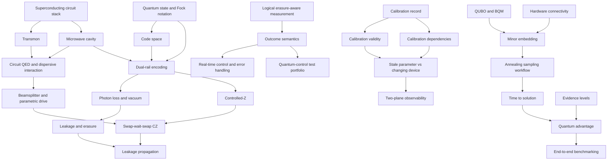

# Concept and prerequisite map

## Implemented taxonomy

| Topic | Content pages | Central question | Source coverage |
| --- | ---: | --- | --- |
| [Dual-rail qubits and erasures](../topics/dual-rail-qubits/README.md) | 8 | How can one excitation across two modes expose photon loss? | Compendium section 3, pages 2, 5, 7, 9-10, 20-21 |
| [Superconducting circuit QED and control](../topics/circuit-qed/README.md) | 7 | Which components and interactions realize the encoded operations? | Section 3, pages 6-7, 11, 19-21; section 4, pages 4-5, 10-12 |
| [Error-aware gates and measurement](../topics/error-aware-gates/README.md) | 11 | How are gates and measurements qualified without flattening structured errors? | Section 3, pages 7, 9-10, 12, 20-21; section 4, pages 4-9, 12, 18 |
| [Calibration systems](../topics/calibration-systems/README.md) | 7 | How does measured behavior become conditional, revocable control state? | Sections 3-4 |
| [Quantum-control software](../topics/quantum-control-software/README.md) | 11 | How does experiment intent reach hardware and return as traceable evidence? | Section 3, pages 3, 8, 11-12, 15, 17-18; section 4, pages 13-19 |
| [Annealing and evidence](../topics/annealing-and-evidence/README.md) | 12 | What does the annealing workflow do, and what supports a comparative claim? | Section 6, pages 2-13 |

Total: **56 canonical content pages** plus topic indexes, references, learning paths, glossary, and metadata records.

Private application and interview logistics remain source material, not reusable knowledge topics.

## Cross-topic graph

This Mermaid view is deliberately compressed. Page front matter is the canonical machine-readable graph.

## Graph measurements

- Longest prerequisite-path depth: **7**.
- Largest direct prerequisite set: **4**.
- Lowest complexity score: **0.0** at 700 nm red.
- Highest current complexity score: **9.5** at 396 nm near violet.
- Deepest current pages: end-to-end benchmarking, leakage propagation, real-time control and error handling, and the quantum-control test portfolio.

See the [complexity model](complexity-model.md) for the exact formula. Derived values are recalculated by `tools/update_complexity.py` and checked by the main validator.

Five current content pages are roots and therefore score `0.0`. [Feedback assessment 1](feedback-assessment.md) accepts the finding that Quantum States and Fock Notation and From Gates to Calibration are roots only because required mathematics and quantum-mechanics foundations are not represented. The other root scores were not challenged by feedback and remain unchanged in this assessment batch.

## Navigation contract

Every content page declares:

- `prerequisites`: content that must be understood first;
- `next_steps`: sensible forward movement, including an index for terminal pages;
- `related`: non-prerequisite neighbors and alternatives;
- `source_files`: local provenance;
- derived complexity fields;
- manual `understanding` from `0` to `10`.

Required learning paths are acyclic and contain prerequisites before dependents. Related links may form cycles because they are navigation, not learning order.

## Decomposition and stop rule

A concept receives its own page when it has an independent definition, reuse, prerequisites, algorithm, examples, or meaningful failure modes. Closely coupled terms stay together when splitting them would create thin pages, such as:

- leakage and erasure;
- transmons and anharmonicity;
- circuit QED and dispersive interaction;
- beamsplitter interaction and parametric drive;
- detection, correction, and postselection;
- QUBO and BQM;
- quantum processing time and time to solution.

The recursion stops where the source merely lists a keyword. QFT, Grover search, VQE, QAOA, BB84, quantum kernels, partial trace, and other resume-only terms are not expanded from model memory.
