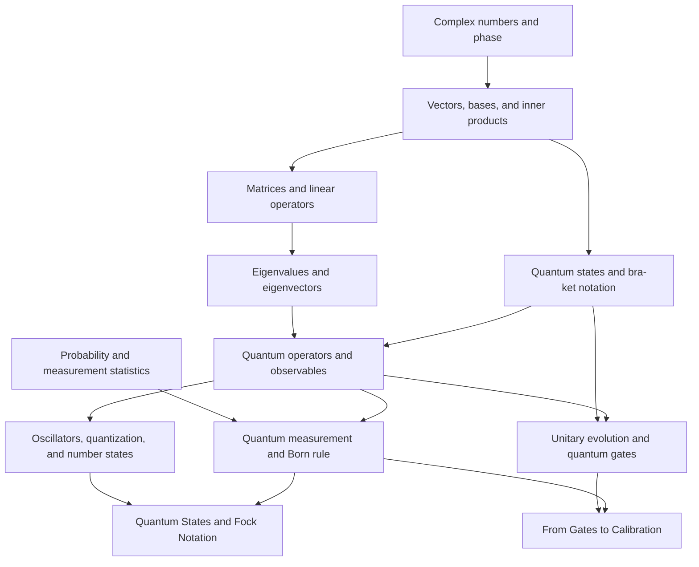

# Feedback assessment 1

Date assessed: 2026-08-14

Input: [`FEEDBACK.md`, feedback 1](../../FEEDBACK.md)

Scope: `NEXT.md` roadmap item 3. This record validates the current structure, identifies what the feedback requires, and defines the next bounded batch. It does not pre-empt roadmap item 4 by adding unsourced teaching pages.

## Validation result

The current tree is internally valid:

- all local links, anchors, prerequisites, next steps, related links, and source references resolve;
- the prerequisite graph is acyclic;
- every content page is reachable from the root;
- all generated complexity values are current;
- 56 rateable content pages remain distributed across six source-backed topics.

The two disputed values are not stale. [Quantum States and Fock Notation](../topics/dual-rail-qubits/fundamentals/quantum-state-and-fock-notation.md) and [From Gates to Calibration](../topics/calibration-systems/fundamentals/from-gates-to-calibration.md) both declare no prerequisites, so the current graph formula necessarily assigns depth `0`, prerequisite count `0`, and complexity `0.0`.

That is a structural defect in the learning model, not a calculation defect. The pages are roots only because the tree omits the mathematics and quantum-mechanics foundations they assume. A graph-relative score of `0.0` means “no represented prerequisites”; it must not be read as “trivial.”

## Feedback disposition

| Feedback request | Current finding | Disposition for roadmap item 4 |
| --- | --- | --- |
| Raise Quantum States and Fock Notation to at least `3.0` | Its assumed foundations are absent | Accept; add real prerequisites and recalculate, never hard-code the score |
| Raise From Gates to Calibration | It begins from an unexplained gate abstraction | Accept; connect it to generic gate, measurement, and physical-control foundations |
| Teach linear algebra and complex numbers | No canonical teaching pages exist | Accept as a new foundation topic |
| Teach states, operators, and measurements | Only narrow downstream uses exist | Accept as a linked quantum-mechanics sequence |
| Add physics prerequisites | Number states, oscillation, and measurement foundations are missing | Accept within the same bounded topic |
| Add guided tests and exercises | Existing pages have static self-checks only | Accept; add deterministic app-native exercises with immediate feedback |
| Add visualizations and simulations | The app renders prose, equations, code, and graphs but no concept lab | Accept a small set of focused two-dimensional interactives; do not hand-roll a physics engine |
| Summarize the resulting changes | No feedback completion record exists | Require an item-4 completion section in this assessment or its successor |

## Required foundation topic

Create one canonical topic, `mathematics-and-quantum-foundations`, rather than scattering remedial definitions through dual rail and calibration. The bounded page set is:

1. Complex numbers, magnitude, and phase.
2. Vectors, bases, and inner products.
3. Matrices and linear operators.
4. Eigenvalues and eigenvectors.
5. Probability and measurement statistics.
6. Quantum states and bra-ket notation.
7. Quantum operators, observables, and expectation values.
8. Quantum measurement and the Born rule.
9. Unitary evolution and quantum gates.
10. Oscillators, quantization, and number states.

The exact decomposition may combine adjacent pages only when authoritative sources treat them as one unit and separation would create thin or circular explanations.

## Planned prerequisite graph

The current target pages should keep their source-backed domain explanations. The new pages supply definitions they currently assume; they do not replace or duplicate those pages.

## Exercise and interaction contract

Roadmap item 4 should add one ordered prerequisite learning path and five focused exercise surfaces:

- a diagnostic that routes missed questions back to canonical pages;
- a complex-phase explorer that connects rectangular and polar form;
- a matrix and eigenvector explorer with deterministic examples;
- a quantum-state and measurement lab that compares amplitudes with repeated measurement frequencies;
- a gate-to-calibration ordering exercise that distinguishes intent, control, measurement, fit, validation, and promotion.

Each exercise must provide immediate, specific feedback, a reset path, keyboard-operable controls, and an explanation linked to the canonical page. Random sampling must use a fixed or user-visible seed so tests are reproducible. Interactive state remains personal application data and must not rewrite canonical Markdown.

## Evidence required before expansion

The preserved local corpus does not explain linear algebra, complex numbers, general state-vector mechanics, operators, observables, the Born rule, or oscillator quantization deeply enough to support these pages. Roadmap item 4 therefore requires a dated source-acquisition pass using authoritative educational or primary sources. Each new page must record exact public links and access dates, and the source inventory must distinguish those external sources from the preserved `base/` corpus.

Model memory is not acceptable provenance. No page may be marked `verified` merely because its explanation is standard textbook material.

## Item-4 acceptance gates

The feedback is incorporated only when all of these are true:

1. The new topic index and prerequisite learning path reach every new page and exercise.
2. The graph remains acyclic and every new prerequisite appears before its dependent in required learning paths.
3. Both named target pages link their new prerequisites in metadata and prose.
4. Regeneration gives Quantum States and Fock Notation a complexity score of at least `3.0` and increases From Gates to Calibration without a manual override.
5. New claims have explicit, authoritative provenance and visible uncertainty boundaries.
6. Interactive exercises have focused logic tests and browser tests for correct, incorrect, reset, and keyboard paths.
7. Desktop and mobile layouts show no overlap or horizontal page overflow.
8. Complexity freshness, the knowledge validator, all Python and app tests, the production build, and `git diff --check` pass.

## Item-3 conclusion

Feedback 1 is accepted and actionable. The existing six-topic tree remains structurally valid, but it is not pedagogically complete at its entry boundary. Roadmap item 4 should implement the bounded foundation topic, prerequisite learning path, rewiring, exercises, sourced explanations, and recalculated complexity described above.