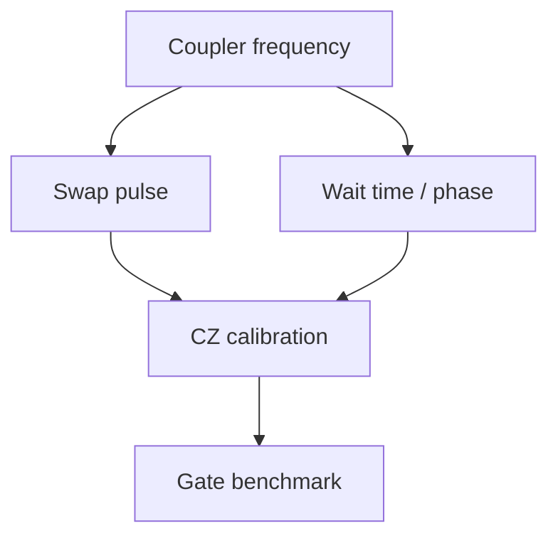

# Calibration dependencies

<!-- study-status:start -->

  Complexity 2.79/10 | 611 nm | 490.7 THz
  <label>Understanding <input type="number" min="0" max="10" value="0" aria-label="Understanding rating for Calibration Dependencies"> / 10</label>

<!-- study-status:end -->

<!-- learning-navigation:start -->
## Learning navigation

- **Prerequisites:** [Calibration Record](calibration-record.md)
- **Next steps:** [Dependency Invalidation Example](../examples/dependency-invalidation.md), [Stale Parameter Versus Changing Device](stale-parameter-vs-changing-device.md)
- **Related:** [Reliable Orchestration](../../quantum-control-software/concepts/reliable-orchestration.md), [Promotion and Rollback](../../quantum-control-software/concepts/promotion-and-rollback.md)

<!-- learning-navigation:end -->

Parent: [Calibration systems](../README.md)

Prerequisite: [Calibration record](calibration-record.md)

Next: [Dependency invalidation example](../examples/dependency-invalidation.md)

## Plain-language meaning

A calibration dependency says that one result relies on another result or system state. If the parent changes, the dependent child may no longer be trustworthy even when the child’s stored number did not change.

## Why it matters

A gate setting is rarely isolated. It may assume particular mode frequencies, pulse behavior, phase timing, and readout classification. Updating one assumption while silently retaining all descendants can assemble a configuration that was never validated together.

## Step-by-step model

1. Treat each versioned [calibration record](calibration-record.md) as a node.
2. Draw an arrow from a parent assumption to each child that was derived or validated using it.
3. When a parent changes, identify every reachable descendant.
4. Mark those descendants stale before another run can select them as valid.
5. Recompute or revalidate only the affected branch, then promote a coherent set of versions.

**Source-backed fact:** The corpus gives this example: a change in coupler frequency can affect swap-pulse frequency and wait-time phase; those changes can invalidate a CZ calibration, which can invalidate its benchmark. [C3, source page 16](../references.md#local-source)

## Precise definition

A calibration dependency is a directed relation `parent -> child` meaning:

> The evidence supporting this child assumes the named version or state of the parent.

The relation does not mean that every parent change physically alters the child. It means the previous evidence no longer proves that the child remains suitable; revalidation may show that its numeric value can stay unchanged.

## Invariants

**Engineering interpretation based on the source:**

- A graph version used by an experiment must identify exact record versions, not mutable names such as `latest`.
- No child may remain `valid` after an incompatible parent version is promoted unless a declared rule or new validation re-establishes validity.
- Invalidation must reach indirect descendants, not only immediate children.
- The graph must reject cycles or give them explicit joint-calibration semantics. A simple prerequisite graph cannot have `A` require `B` while `B` requires `A`.
- Promotion should expose one coherent graph state; readers should not observe half of an update.

## Analogy: a compiled program and its library

**Analogy:** A compiled program may depend on an exact library interface. Replacing the library can require rebuilding or retesting the program even if its source did not change.

**Where the analogy stops:** Calibration dependencies can reflect uncertain physical relationships and measured device state, not only deterministic software compatibility.

## Examples and non-examples

**Example:** Promoting a new coupler-frequency record marks the swap pulse, wait time, CZ calibration, and benchmark stale. The [worked example](../examples/dependency-invalidation.md) executes this traversal.

**Non-example:** Store an unordered list of “related parameters” with no parent direction. The system cannot know which change withdraws trust from which result.

**Non-example:** Invalidate only direct children. A benchmark can then remain valid even though the CZ calibration that supported it became stale.

## Relationships

- [Calibration validity](calibration-validity.md) defines dependency change as one possible revocation condition.
- [Stale parameter versus changing device](stale-parameter-vs-changing-device.md) uses lineage to identify outdated software state.
- [Diagnose calibration drift](../algorithms/diagnose-calibration-drift.md) combines graph evidence with physical time-series evidence.

## Failure modes and misconceptions

- **“The graph detects drift.”** It detects changes represented by known nodes or events. Unknown physical motion still needs monitoring.
- Parent identity is captured without a version.
- A failed candidate invalidates production descendants even though it was never promoted.
- Concurrent writers race and expose a mixed graph.
- Manual overrides bypass descendant invalidation.
- The graph grows but no run records which graph snapshot it used.

## Self-check

1. Why can a child become stale without its number changing?
2. What is lost if dependencies are undirected?
3. Why must invalidation traverse more than one edge?
4. What kind of device change can a dependency graph miss?

## Sources and status

- Main evidence: [Repeated-CZ fundamentals, source page 16](../../../../base/DWave_Application_and_Study_Materials.md#4-repeated-cz-calibration-question-fundamentals).
- Supporting production invariants: [Dual-rail conversation guide, source page 8](../../../../base/DWave_Application_and_Study_Materials.md#3-luke-mastalli-kelly-d-wave-and-the-dual-rail-stack-conversation-study-guide).
- Status: `draft`. The relation and example are source-backed; the invariants are labeled engineering interpretation rather than a private-stack description.
